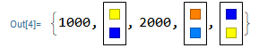
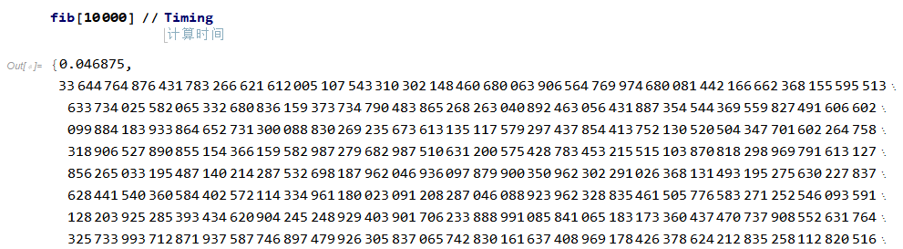
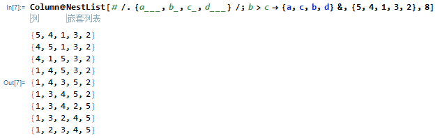

# Introduction to AI for Architects
[](https://wolfr.am/R9t3nRdo)
## Notes

### 变量与函数
- 可提前定义部分参数
    ``` Mathematica
    f[Red] = 1000
    f[Green] = 2000
    (*Clear[f] 可清除之前的定义*)
    f[x_] := Framed[Column[{x, ColorNegate[x]}]]
    {f[Red], f[Yellow], f[Green], f[Orange], f[Blue]}
    ```
      

- 函数传参可在下划线后跟参数类型，如 `n_Integer`   
    **定义阶乘：**
    ``` Mathematica
    factorial[n_Integer] := n*factorial[n - 1]
    factorial[1] = 1
    ```
    **定义斐波那契数列：**
    ``` Mathematica
    $RecursionLimit = Infinity; (*设置递归最大深度，默认为1024*)
    fib[0] = 1;
    fib[1] = 1;
    fib[n_Integer] := fib[n] = fib[n - 1] + fib[n - 2]
    ```
    

### 模式匹配
- **用模式匹配实现冒泡排序**
  ``` Mathematica
  {5, 4, 1, 3, 2} //. {a___, b_, c_, d___} /; b > c -> {a, c, b, d} (*忽略中间过程*)
  ```
  
### Web App and API


